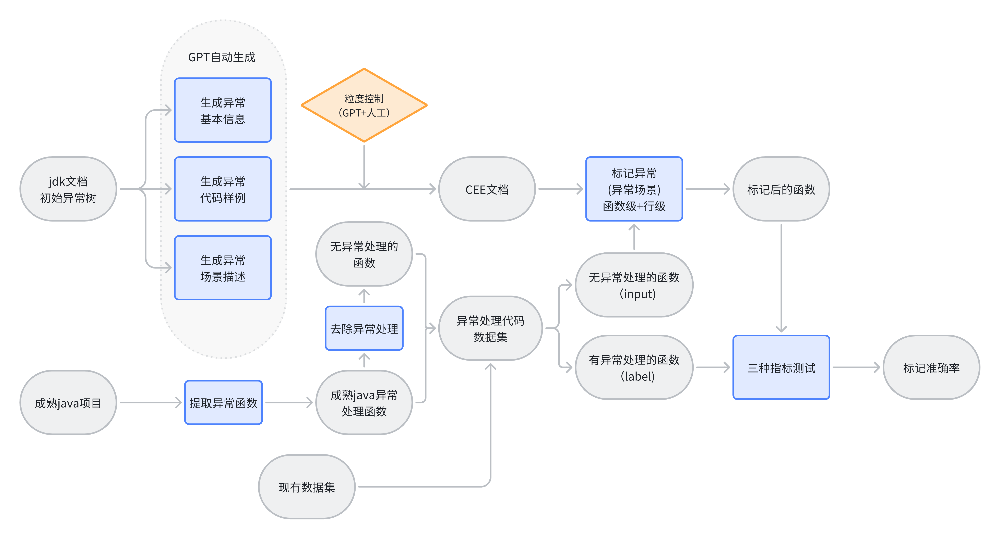

# CEE pipeline

## 代码描述
    - `gen_info.py` 和 `gen_scenario.py`：生成\更新CEE的描述
    - `crawl.py`：爬取GitHub上的java项目
    - `get_func.py`：提取java项目中带有异常处理的函数
    - `clean.py`：将上面提取的函数进行清洗，去除其中的异常处理
    - `label.py`：根据CEE的描述，对原始函数进行场景级别和行级别的标注
    - `test.py`：根据CEE的描述，对去除异常处理的函数进行场景级别和行级别的标注
    - `score.py`：计算标注的准确率

## Pipeline描述
整体pipeline大致如下图所示

1. 生成\更新CEE的描述
采用GPT加人工的方式生成\更新CEE的描述，有些粒度控制需要调prompt加人工干预
2. 测试数据集
- yh现在做了可以使用的现成数据集（无须爬取清洗步骤
- 现在测试还是基于GPT为主
有两个测试思路：
  1. 按层级，给出全部场景，直接标注（快，拉胯，但是多标的少
  2. 按层级，依次分别判断是否属于某个场景，对所有是的继续进入下一层级（慢。特别是逐行标，准确率较高，易多标

  目前结果

  |metric|score|
  |---|---|
  |recall|0.76|
  |coverage|0.49|
  |llmreview|极不稳定|

## 改进思路
1. CEE描述的粒度控制，现在人工干预比较多，提准确率在这块可能还有空间
2. 目前测试的标注基本还是完全依赖GPT，可以考虑引入其他传统方法，以及进行一些粒度夹逼